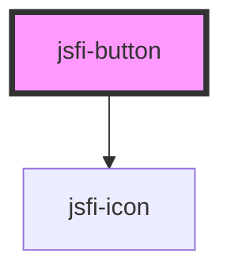

# jsfi-button

<!-- Auto Generated Below -->

## Properties

| Property  | Attribute | Description   | Type      | Default     |
| --------- | --------- | ------------- | --------- | ----------- |
| `color`   | `color`   | Color field   | `string`  | `"blue"`    |
| `icon`    | `icon`    | Icon field    | `string`  | `undefined` |
| `outline` | `outline` | Outline field | `boolean` | `undefined` |
| `radius`  | `radius`  | Radius field  | `boolean` | `undefined` |
| `size`    | `size`    | Size field    | `string`  | `undefined` |

## Dependencies

### Depends on

- [jsfi-icon](../icon)

### Graph

----------------------------------------------

*Built with [StencilJS](https://stenciljs.com/)*
