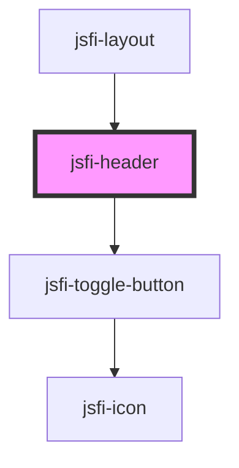

# jsfi-header

<!-- Auto Generated Below -->

## Dependencies

### Used by

 - [jsfi-layout](../layout)

### Depends on

- [jsfi-toggle-button](../toggle-button)

### Graph

----------------------------------------------

*Built with [StencilJS](https://stenciljs.com/)*
