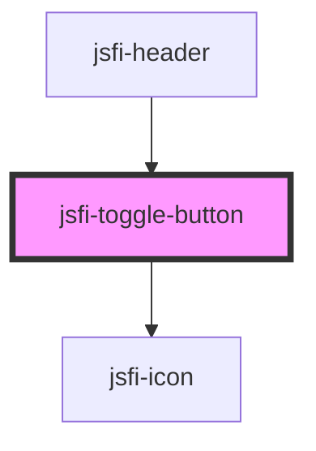

# jsfi-toggle-button

<!-- Auto Generated Below -->

## Events

| Event        | Description | Type               |
| ------------ | ----------- | ------------------ |
| `menuToggle` |             | `CustomEvent<any>` |

## Dependencies

### Used by

 - [jsfi-header](../header)

### Depends on

- [jsfi-icon](../icon)

### Graph

----------------------------------------------

*Built with [StencilJS](https://stenciljs.com/)*
